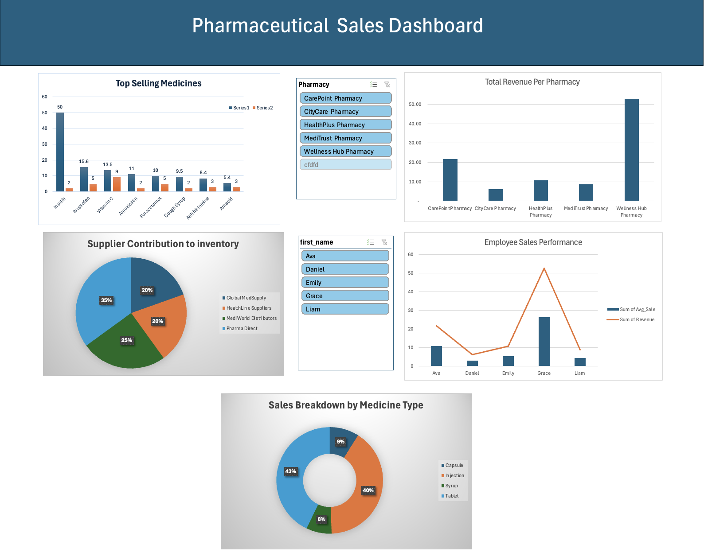
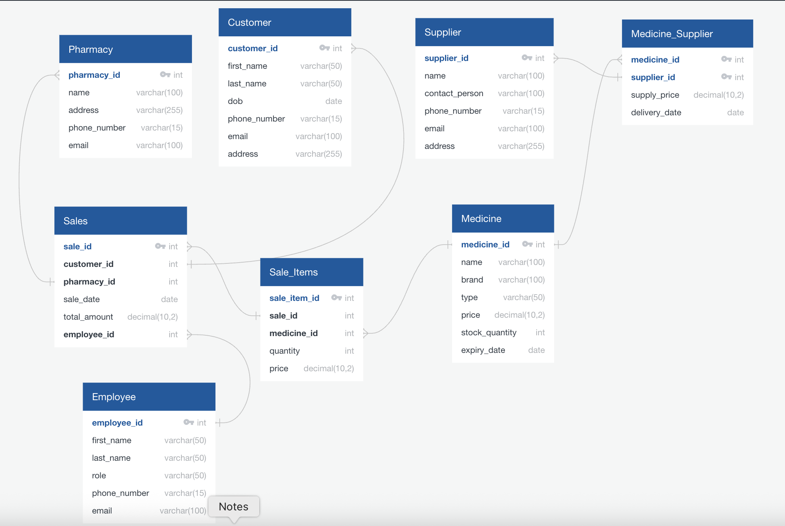

## 📌 Overview

This project is an **end-to-end data analytics solution** for a pharmaceutical retail chain.  
It covers **database design, data integration, analytics queries, and business intelligence dashboarding**, providing insights into sales, inventory, suppliers, and employee performance.

The solution is designed to be **cloud-ready** and compatible with platforms like **Snowflake** and **AWS RDS**, and can be integrated with orchestration tools such as **Apache Airflow** or **Control-M** for automated reporting.

---

## 🎯 Objectives

- Design a **normalized relational database** to store sales, inventory, and supplier data.
- Develop **analytical SQL queries** to generate KPIs and business reports.
- Build an **interactive dashboard** to visualize performance metrics and trends.
- Enable **automation potential** for alerts and scheduled reporting.

---

## 🛠️ Technologies Used

- **SQL** (MySQL syntax, portable to Snowflake/AWS RDS)
- **Excel / BI Dashboard** for data visualization
- **Relational Database Design** with primary & foreign keys
- **ETL-ready queries** for integration with BI tools or automation workflows

---

## Key Features & Insights

**Database Design**

- Fully normalized schema for **Pharmacy**, **Customer**, **Medicine**, **Sales**, **Employees**, and **Suppliers**.
- Referential integrity with primary & foreign key constraints.

**Analytics Queries** (`business_analytics_queries.sql`)

- **Total Revenue per Pharmacy**
- **Top 10 Selling Medicines**
- **Supplier Contribution to Inventory Cost**
- **Sales Breakdown by Medicine Type**
- **Monthly Sales Trends**
- **Low Stock Alerts**
- **High-Value Sales Monitoring**
- **Expiring Medicines Alert**
- **Employee Sales Performance**
- **Top-Spending Customers**

**Business Intelligence Dashboard** (`Dashboard.xlsx`)

- Visualizes sales trends, top products, revenue by location, and employee performance.
- Includes KPIs and conditional formatting for alerts.
